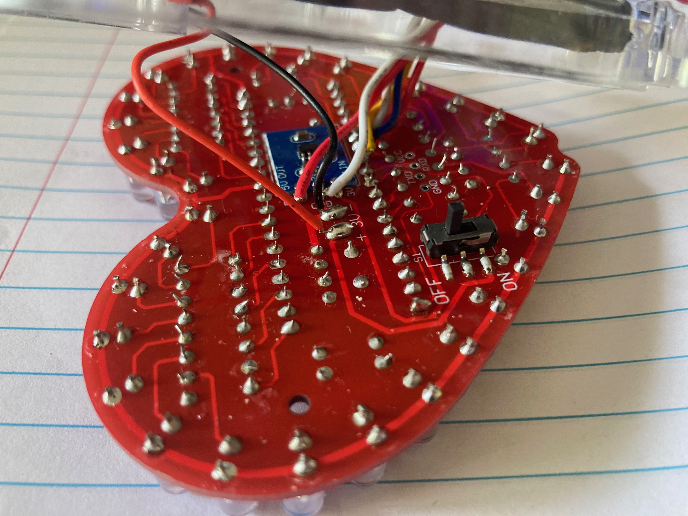
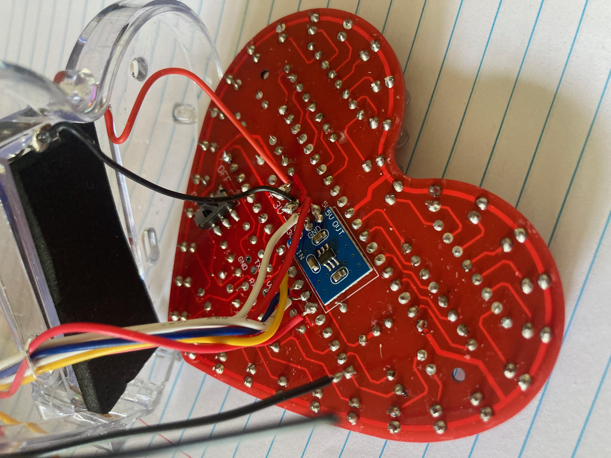
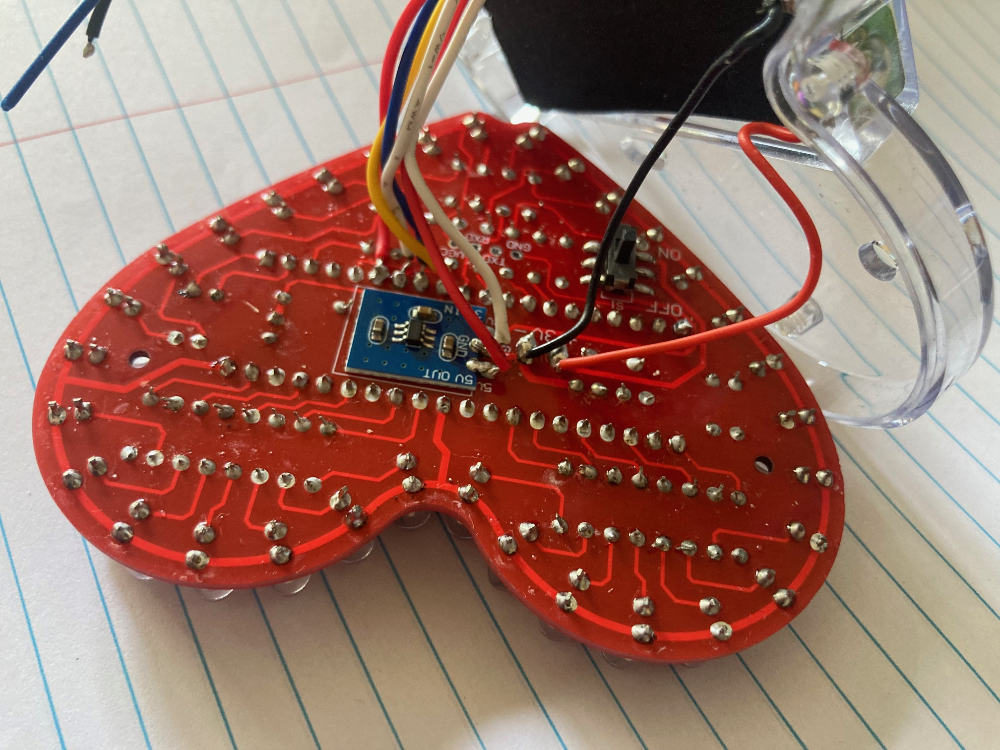
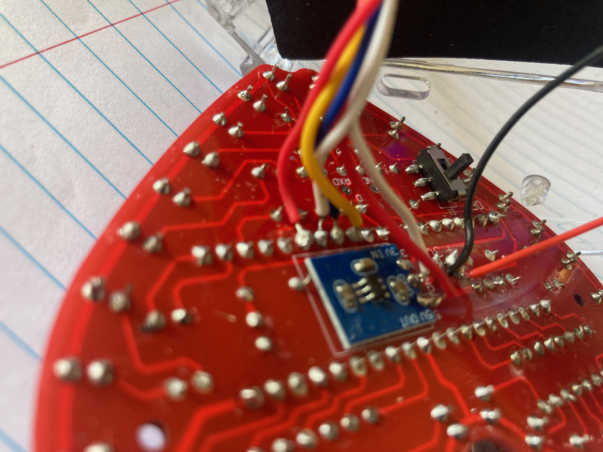
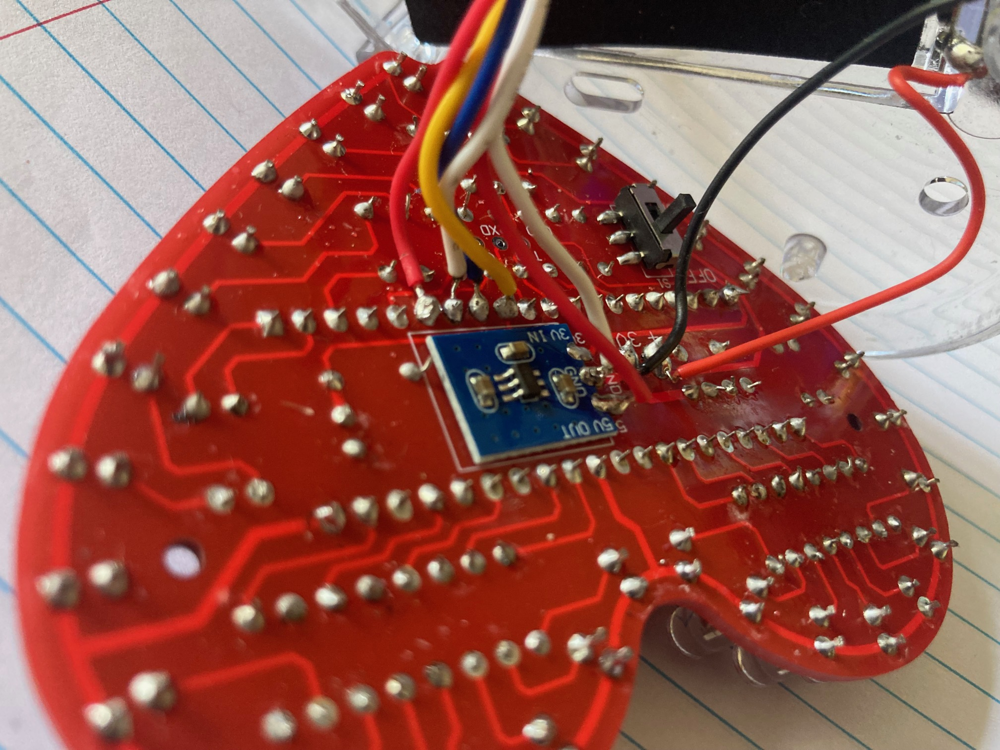
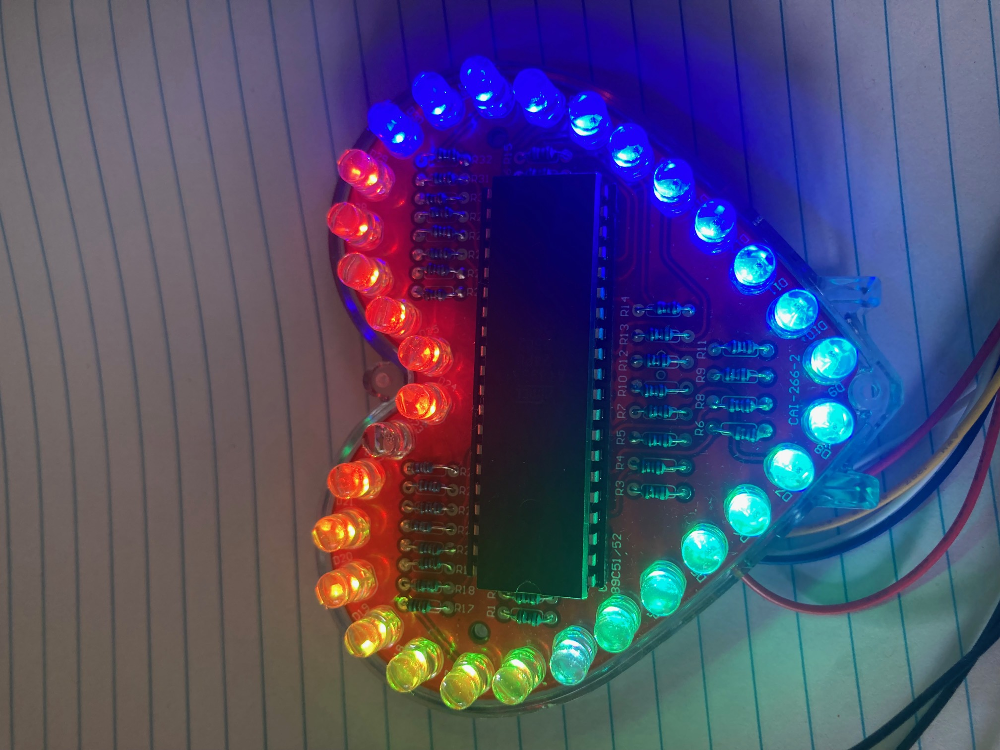

Reprogramming the AT89S51 in the heart lamp


https://www.aliexpress.com/item/1005008809128215.html

Steps

0. Download software
    - SDCC compiler, for compiling the 8051 software
    - avrdude, for sending the built 8051 software to the USBasp programmer
    - avrdudess, a GUI for operating avrdude
1. Purchase
    - the lamp kit
    - at least one additional AT89S51 microcontroller, as the "S" model can be programmed in ciruit
    - two USBasp programmer devices (two because you need one of these to program the other with the firware in tools\USBasp)
    - at least one 10 pin IDC female connector
    - additional wires at least seven, dupont or similar
    - soldering iron, solder, tweezers, small pliers with cutter
2. Assemble the lamp kit
3. Solder an IDC female connector to the wires
4. Solder the wire ends to the AT89S51 pins for in circuit serial programming (ISP), see photos:
    - MOSI  (master out slave in) is pin 6 on the AT89S51
    - MISO  (master in slave out) is pin 7
    - SCK   (slave clock) is pin 8
    - RST   (reset) is pin 9. Held high to enter ISP mode.
    - VCC   (voltage at the common collector) is pin 40, but solder this to the +5v output of the battery voltage booster module.
    - GND   (ground) is pin 20, but solder this to the ground of the battery voltage booster module.
6. Update the firmware on a USBasp, by using AVRDUDESS or avrdude and the firmware in tools/USBasp
    - this firmware has been modified to support the AT89S51 as this MCU needs the reset line held high,
       the opposite to other MCUs. The firmware came from https://github.com/dioannidis/usbasp
    - the USBasp typically has an ATMega8a or similar
    - the command line will look like
    ```
    avrdude -c usbasp-clone -p m8a -P usb -U flash:w:"C:\Users\owner\Repos\heartlamp\tools\USBasp\USBasp_ATMega8_12MHz_TPI_HIDUART_SNWRITE.hex":a -U eeprom:w:"C:\Users\owner\Repos\heartlamp\tools\USBasp\USBasp_EEPROM.eep.hex":a 
    ```
7. Connect the updated USBasp programmer to the IDC connector using the ribbon cable that came with the programmer, and a PC USB port
8. Build src/heartleds.c
    - see the build.bat file
9. Run AVRDUDESS or use avedude on the commandline to update the AT89S51 with the built code in bin/heartleds.hex
    - see the install.bat file
    - the customised tools/avrdude/avrdude.conf file has a section for the AT89S51







